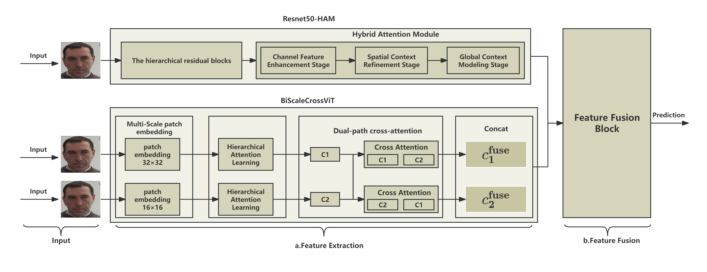

# AACSFNet
Pain Intensity Evaluation

## Introduction 
The AACSFNet comprises a channel sub-network and a spatial sub-network for feature extraction. The GSFF augments data by integrating facial landmarks and anatomical descriptions into textual prompts, utilizing depth-guided image generation. 

## Overall Pipeline

The Attention-Aware Channel-Spatial Fusion Network (AACSFNet) comprises three key components:  
1) Channel-subnet (ResNet50-HAM): A modified ResNet50 backbone integrated with a Hybrid Attention Module (HAM) to hierarchically extract and recalibrate channel-wise semantic features.
2) Spatial-subnet (BiScaleCrossViT): A multi-granularity vision transformer with dual-path cross-attention for capturing transient local features and global contextual patterns.
3) The feature fusion block then aligns and integrates their outputs through multi-head attention and residual connections, enabling the model to synthesize discriminative representations for accurate pain intensity regression.  

1) fMRI images parcellated by an atlas to obtain the Functional connectivity matrix for ’N’ ROIs. Rows and columns are rearranged based on community labels of
each ROI to obtain input matrices to local transformer
2) Overview of our local-global transformer architecture: Human brain connectome is a hierarchical structure with ROIs in the same community having greater similarities compared to inter-community similarities. Therefore, we designed a local-global transformer architecture that mimics this hierarchy and efficiently leverages community labels to learn community-specific node embeddings. This approach allows the model to effectively capture both local and global information.
3) Transformer encoder module

## Quick Start Guide 
How to train AACSFNet.

Installation

